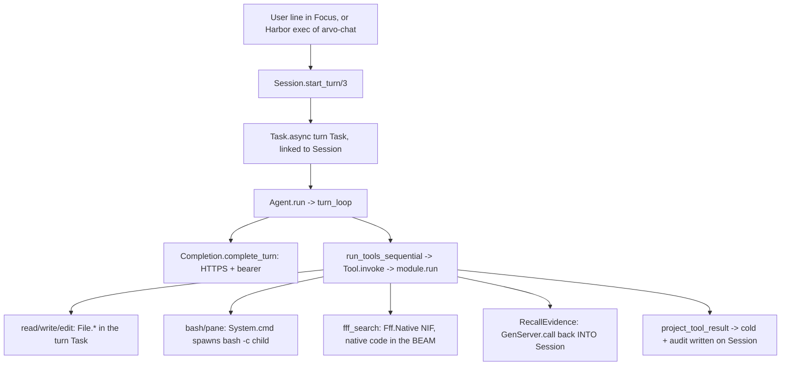

# G-002 deliverable 1. Arvo tool-execution and secret topology

Repo `/Users/robertguss/Projects/startups/arvo-harness` at commit `016d2f8`
(2026-08-16). Audience: Robert Guss. Never prints secret values. Paths and
variable names only.

Governing cards: [D-001](DECISIONS.md) (grid not ladder; two threats only; name
every door) and [SORT.md](SORT.md) G-002 (the isolation ladder is the plan;
report what the tree has).

Regenerate the mechanical inventory (not this prose) with:

```bash
node research/scripts/g002-topology-scan.mjs
```

---

## Overview

The picture D-001 asked for is a brain that calls tools, with the tools living in
a separate building. Prove the building cannot read the wallet. Prove an
explosion in the building does not touch the house. Today there is no separate
building. Every Arvo tool runs in the same house as the brain. Most tools run in
the brain's own rooms (BEAM processes inside one `beam.smp`). The `bash` and
`pane` tools step into the attached yard (a short-lived OS child of that same
BEAM). Named secret env keys are unset on those children. The child can still
walk the disk as the same user, including `cat` of `$HOME/.arvo/auth.json`.

There is no garage. The garage in D-001 means an OS boundary that the tool cannot
cross back through: a port program, a peer node, or a container that holds only
hands. None of those exist in the tree. Harbor's Docker is real, but it is a wall
around the whole property, not a wall between the house and a garage. `XAI_API_KEY`
is handed into that container and sits next to `bash`. So for G-002's two
questions, the honest answer today is: crash containment is partly real at the
Elixir level and has two holes; payload containment is a cheap inner latch on two
doors, not a separate building.

---

## Key concepts

- **Brain.** The model loop. It decides which tools to call and holds the API
  bearer while it talks to the model over HTTPS. In code the brain is
  `Arvo.Agent.run/3` running inside a turn Task.
- **Hands.** The tools. `read`, `write`, `edit`, `bash`, `pane`,
  `RecallEvidence`, plus the bundled `fff_search` plugin tool. "Hands" is the
  role, not a separate machine. Today hands and brain share one BEAM.
- **Session.** A named, permanent GenServer (`Arvo.Session`). It owns history,
  the projection of tool results, the cold-evidence store, and pane bookkeeping.
  It is the thing G-002 wants to keep alive when a tool dies. It survives
  Elixir-level failures because it sets `trap_exit` and because it is the
  supervised, durable part (JSONL on disk is the real Session).
- **Turn Task.** For each turn, Session spawns `Task.async` (`session.ex:846`).
  That Task runs the brain and, in sequence, every tool for that turn. It is
  linked to Session, but Session traps exits, so an abnormal Task death is caught
  as a message, not a cascade.
- **Doors.** The four ways a secret can be reached, from D-001: environment
  variables, VM state (process heaps, `persistent_term`, application env), the
  wire between nodes, and files on disk.

---

## How it works

### Flow from the input line to the tool work call

Two entry points, one tool path.

- Interactive: `Arvo.TUI.Focus.spawn_chat/1` builds a `TurnContext` and calls
  `Session.start_turn/3`.
- Headless / Harbor: `arvo-chat` runs `bin/arvo eval 'Arvo.CLI.Chat.main()'`
  (`rel/overlays/bin/arvo-chat:22`), which starts the app and calls
  `Session.start_turn/3` the same way.

From there the path is identical.



Two facts from that diagram carry most of the weight. First, the bearer lives in
`Arvo.Auth.TokenManager` and is copied into the turn Task while it talks to the
model (`token_manager.ex`, `completion.ex:167`). The same turn Task then runs the
tools. Second, tools do not get the bearer or the Session pid handed to them. The
tool context is only `%{cwd, session_id, config, tool_call_id}` (`agent.ex:328`),
and `session_id` is a string, not a pid. That sounds like containment. It is not,
because everything a tool needs to reach a secret is a named process or a file
path away, and nothing stops an in-VM tool from asking.

### Per-tool execution table

"Same OS user" and "inherits env" are asked against the brain's BEAM. "Reads
`$HOME/.arvo/auth.json`" means can the tool reach that file as written today.
Read, Edit, and Write refuse the home store. Bash `cat` still succeeds. Mode
`0600` does not stop the owner.

| Tool | Work call and where it runs | Same OS user as brain? | Inherits brain env? | Can read `$HOME/.arvo/auth.json`? | Crash mode and does Session survive? |
|---|---|---|---|---|---|
| `read` | `File.read/1` in the turn Task. `Arvo.Isolation.resolve_tool_path/2` expands (including absolute `..`) and refuses `$HOME/.arvo`. | Yes | Yes (in-VM) | No for `$HOME/.arvo` via Read. Bash `cat` of the same path still works. | Elixir raise is caught by `Agent.run` rescue (`agent.ex:55`). Session survives. |
| `edit` | `File.read` then `File.write` in the turn Task. Isolation refuses before either call. | Yes | Yes | No for `$HOME/.arvo`. | Same as read. Session survives. |
| `write` | `File.mkdir_p` + `File.write` in the turn Task. Isolation refuses before `mkdir_p`. | Yes | Yes | Cannot overwrite `$HOME/.arvo` via Write. | Same as read. Session survives. |
| `bash` | `System.cmd("bash", ["-c", command], cd:, stderr_to_stdout: true, env: Arvo.Isolation.cmd_env())` from a nested `Task.async`. Runs as an OS child of the BEAM through an Elixir-owned spawn Port. | Yes | Partial. `cmd_env/0` unsets `XAI_API_KEY`, `RELEASE_COOKIE`, `ARVO_AUTH_FILE`, and live `*_API_KEY`. PATH and HOME still inherit. | Yes. `cat "$HOME/.arvo/auth.json"` still works. The path jail is File tools only. `0600` does not stop the owner. | OS process nonzero or crash returns `{output, code}`. Session survives. Timeout does `Task.shutdown(:brutal_kill)`. Orphan grandchildren are possible and unmeasured (H-171). |
| `pane` | If `Herdr.available?` (needs `HERDR_ENV=1` + `herdr` on PATH): `System.cmd("herdr", ...)` control calls with `env: Arvo.Isolation.cmd_env()`, workload runs in a multiplexer pane (`herdr/cli.ex`). Else falls back to the `bash` path (`pane.ex:59`). | Yes | Partial on herdr control (same overlay as bash). Fallback is the bash path. Pane shell env is not proven. | Yes (same as bash on the fallback path). | herdr nonzero is handled. Fallback equals bash. But `register_pane` / recall calls run in Session `handle_call`; an exception there can crash Session. |
| `RecallEvidence` | `Arvo.Session.recall/2`, a `GenServer.call` that runs the disk read inside Session's own `handle_call` (`recall_evidence.ex:59`). | Yes | n/a (in-VM) | Reads cold sidecar files by design; runs inside the brain's own process. | Worst for crash. An exception in the recall handler crashes Session itself. The tool's `try/catch :exit` only helps if Session is already dead (`recall_evidence.ex:76`), not for a raise inside the handler. `one_for_one` restarts Session with empty state; disk JSONL is durable. |
| `fff_search` (plugin) | `Fff.Native.search/2`, a Rustler NIF on a normal scheduler thread (`native/fff_search/src/lib.rs:9`, no `DirtyCpu`). | Yes | Yes (native code in the BEAM process) | Yes. `WalkDir` descends `.arvo` and reads `auth.json`; the dotfile skip only applies to basenames starting with `.`, and `auth.json` does not (`lib.rs:33`). | Worst for crash. A Rust panic or segfault takes down the whole BEAM including Session. No BEAM fence helps a native crash. |

### Fence-versus-threat grid

Two threats, scored per site. Payload leak is "can this tool read the brain's
secrets." Crash/kill is "can this tool's failure take down Session."

| Execution site | Payload leak fence | Crash/kill fence |
|---|---|---|
| `read` / `edit` / `write` (in-VM Elixir, turn Task) | `$HOME/.arvo` path jail via `Arvo.Isolation.resolve_tool_path/2`. Same user, in-VM. No env fence. | Real, at the Elixir level. A raise is caught by `Agent.run`'s rescue; Session lives. |
| `bash` (OS child via `System.cmd` Port) | Env overlay unsets named secrets. Disk is open: `cat` still reads `auth.json`. | Partial. The OS boundary means a bash crash returns a value and Session lives. Caveats: orphan grandchildren (H-171), and a raise inside the inner spawn Task is an open question. |
| `pane` (herdr control + pane shell, or bash fallback) | Herdr control uses the same env overlay as bash. Pane shell env is not proven. Fallback equals bash, so `cat` of the store still works. | Partial. Same OS story as bash for the workload. Hole: pane bookkeeping runs in Session `handle_call`, so an exception there crashes Session. |
| `RecallEvidence` (in-VM, on the Session process) | None. It runs inside Session, so it can reach Session state and any named process. | None. It runs inside Session. An exception in the handler is a Session crash. |
| `fff_search` (in-VM NIF, native) | None. Native code can read any file the user can, and can touch VM memory directly. | None. A native crash aborts the whole BEAM. |
| Harbor Docker (wraps the whole node) | Not a brain-from-hands fence. `XAI_API_KEY` is injected into the same container as `bash` (`arvo_agent.py:227`). | Not a hands fence. If the BEAM dies, the whole container dies with it. It is an outer wall around house plus yard together. |

The one-line reading: in-VM Elixir File tools have a real crash fence and a
`$HOME/.arvo` path jail. `bash` has a partial crash fence and an env overlay;
disk is still open. The NIF and `RecallEvidence` have neither. Docker is a
property wall, not a hands fence. Do not score it as one.

---

## Where secrets live

Four doors, named per D-001. Values are never printed here.

### Door 1: environment variables

- `XAI_API_KEY`. The only credential env the Elixir app reads.
  `TokenManager.api_key_fallback("grok")` checks it, and checks it before the
  OAuth store (`token_manager.ex:158`, ordered ahead of stored tokens at
  `token_manager.ex:92`). So env shadows OAuth. Bash and herdr children get
  `env: Arvo.Isolation.cmd_env()`, which unsets this key. Prompt `git`, plugin
  `mix compile`, and Focus `test -t 0` still inherit the full parent env.
- `RELEASE_COOKIE`. On the Mix release path, `arvo-chat` runs `bin/arvo eval`,
  and Mix `eval` exports `RELEASE_COOKIE` into the process environment. Its value
  comes from the release `cookie: "arvo_headless"` in `mix.exs:36`. Bash children
  no longer inherit that cookie string. `cmd_env/0` unsets `RELEASE_COOKIE`.
  `eval` still sets the cookie on the BEAM process itself, but does not start a
  named node, so this remains a string in the parent environment, not a live
  `:erpc` endpoint.
- Locators, not credentials: `HOME`, `PATH`, `ARVO_CWD`, `ARVO_HEADLESS`,
  `ARVO_MODE`, `ARVO_PROGRESSIVE_ATTENTION`, `HERDR_ENV`, and the other `ARVO_*`
  flags.
- `ARVO_AUTH_FILE` is not read by the Elixir app. Zero matches under `lib/`
  except the Isolation unset list. It exists in the Harbor Python adapter
  (`arvo_agent.py:42`), which treats it as a host path and uploads it into the
  container. `cmd_env/0` still unsets it on bash and herdr children. Do not
  document it as a product knob.

### Door 2: VM state

- `Arvo.Auth.TokenManager` heap. A named GenServer holding
  `%{tokens: %{provider => creds_map}}` with the OAuth `access_token` and
  `refresh_token`. `bearer/1` copies the bearer into the calling process, which
  is the turn Task during completion. Any in-VM tool can call
  `Arvo.Auth.TokenManager.bearer/1` by name; core tools do not, but nothing
  stops them.
- `Application.get_env(:arvo, :config)`. The full parsed `config.toml`, including
  the `providers` table. This is the second `api_key` door.
  `api_key_fallback` reads `providers.xai.api_key` from it (`token_manager.ex:160`).
- `Arvo.Session` state does not hold a bearer, a cookie, or an auth map. It does
  hold `tokens`, but that is `Arvo.Session.Tokens`, per-turn and cumulative usage
  accounting (`session/tokens.ex:4`). It is not API keys. This name collision is
  a trap in a topology map. Call it usage accounting.
- `persistent_term` holds only the Herdr availability boolean
  (`herdr.ex:27`). Not a secret.

### Door 3: the wire

- HTTPS, not BEAM distribution. `Completion` posts to `https://api.x.ai/v1` with
  `auth: {:bearer, bearer}` (`completion.ex:167`). Device flow posts to
  `auth.x.ai`. These carry the credential, but over TLS to x.ai, not between
  Arvo nodes.
- BEAM distribution is not running. `lib/` has zero `Node.`, `:net_kernel`,
  `:peer`, `:erpc`, `:rpc`, or `set_cookie`. The release cookie is set on
  `start` / `daemon` / `rpc` / `remote`, and is passed by `eval` as a string, but
  the product Harbor path is `eval` with no `--sname`, so there is no listening
  node. A shared cookie would be pairing, not a fence, and there is nothing
  paired today.

### Door 4: disk

All under `$HOME/.arvo` unless noted. Constructed from
`System.get_env("HOME")` (`store.ex:9`).

- `auth.json`. The OAuth store. Written mode `0600` by `Arvo.Auth.Store`
  (`store.ex:42`). Read, Edit, and Write refuse this path. Bash `cat` still
  reads it. Same-user `0600` is not a fence.
- `config.toml`. May hold `providers.xai.api_key`. It is not chmod'd to `0600`.
- `trust.json`. Plugin source allowlist, mode `0600`. Not a tool jail.
- `sessions/<slug>/<ts>_<uuid>.jsonl`, plus `<session>.audit.jsonl` and
  `<session>.cold/<id>.body`. Conversation, audit, and cold evidence. Not a
  designed secret store, but tool stdout can persist a leaked env value if a tool
  echoed one.
- `/tmp/arvo-bash-*.log`. Bash truncation spill (`bash.ex:91`). Same risk if a
  command printed a secret.
- Release `releases/COOKIE`. Written by Mix at assemble from the `mix.exs`
  cookie string.
- Harbor extra: the uploaded store lands at `/home/agent/.arvo/auth.json` and is
  `chmod 644` (`arvo_agent.py:156`), which is weaker than the product `0600`. In
  that container any user can read it.

---

## Where things live

- Dispatch: `lib/arvo/tool.ex` (behaviour, `core_tools/0`, `invoke/3`),
  `lib/arvo/agent.ex` (loop, `run_tools_sequential/4`, `tool_ctx/2`),
  `lib/arvo/turn_context.ex` (tool list assembly).
- Session and turn: `lib/arvo/session.ex` (`init/1` trap_exit at 252,
  `start_turn` at 798, `{:EXIT, ...}` at 992, cancel at 866).
- Tools: `lib/arvo/tools/{read,edit,write,bash,pane,recall_evidence}.ex`.
- Plugin tool and NIF: `lib/fff/{plugin,search_tool,native}.ex`,
  `native/fff_search/src/lib.rs`.
- Pane control: `lib/arvo/herdr.ex`, `lib/arvo/herdr/{cli,fake}.ex`.
- Secrets: `lib/arvo/auth/{store,token_manager,device_flow}.ex`,
  `lib/arvo/config.ex`, `lib/arvo/providers/completion.ex`.
- Cold and accounting: `lib/arvo/session/{cold,tokens,store,audit}.ex`,
  `lib/arvo/attention.ex`.
- Entry points: `lib/arvo/cli/chat.ex`, `lib/arvo/tui/focus.ex`,
  `rel/overlays/bin/arvo-chat`, `bin/arvo`, `mix.exs`.
- Harbor: `evals/harbor_agents/arvo_agent.py`,
  `evals/arvo-attention-reread/environment/Dockerfile`, `evals/README.md`.

---

## SORT's ladder versus the tree

SORT G-002 names an isolation ladder as the plan: OS process, then Port, then a
hidden `:peer` node, then a Docker node holding hands. That ladder is the design
target. It is not what the tree has.

- The tree is rung zero. In-VM baseline. Every tool runs in the Session's BEAM,
  either as Elixir in the turn Task, as native code in the NIF, or inside the
  Session process (`RecallEvidence`).
- The only OS-process rungs are Elixir `System.cmd` spawns: `bash` for the bash
  and pane tools, `herdr` for panes, plus `mix compile` at plugin load and
  `git status` at prompt build. These are OS children of the BEAM. They are not
  an Arvo-owned hands Port.
- There is no `Port.open` owned by Arvo. `System.cmd` opens a spawn Port under
  the hood, but Arvo does not own or monitor a long-lived Port as a hands seam.
- There is no hidden `:peer` node and no distribution. No `--hidden`, no
  per-session cookie, no `Hands.API`.
- There is no Docker-as-hands. Harbor's Docker wraps the whole `arvo-chat` node
  for evals. It is the outer sandbox, not a per-tool jail.

So on the ladder, Arvo stands on the ground floor. Reaching rung one for real
means an Arvo-owned Port or node that holds `bash` and the NIF and cannot read
the four doors above.

---

## Gotchas

- The crash fence is one level up from where you might look. `Tool.invoke` has no
  `try/rescue` (`tool.ex:57`). The rescue that saves Session is in `Agent.run`
  (`agent.ex:55`). It catches Elixir raises and `:exit`. It does not and cannot
  catch a native NIF abort.
- `RecallEvidence` is the one tool that runs in the Session process, not the turn
  Task. That makes it the Elixir-level crash hole. A raise inside the recall
  handler is a Session crash, restarted with empty RAM state.
- `fff_search` is a normal-scheduler NIF. A panic or segfault is a whole-VM
  abort. It also blocks a scheduler while it walks disk. The `.so` is a build
  artifact and gitignored, so this is reasoned from source, not observed here.
- `XAI_API_KEY` beats the OAuth store. If both are present, env wins
  (`token_manager.ex:92`). Easy to misread as store-first.
- `config.toml` is a second key door and is not `0600`. The store gets the chmod;
  the config file does not.
- `Session.tokens` is usage accounting, not API keys. Do not draw it as a
  credential in the map.
- Mix `eval` still exports `RELEASE_COOKIE` without starting a node. The cookie
  is a string on the BEAM process. Bash children no longer see it. `cmd_env/0`
  unsets that key.
- Harbor Docker is not a secret fence. The key is inside the container next to
  the shell. Score it as a property wall, not a hands wall.
- The agent doc comment says "core four." `core_tools/0` returns six
  (`tool.ex:23`). Trust the code.

### Baseline Mix measurements (in-VM, `016d2f8` plus this branch)

Free tests in `test/arvo/g002_isolation_baseline_test.exs`. Markers only. Temp
`HOME`. No real wallet.

- H-123, payload. Mix now asserts the env and Read/Write fences hold. With
  `XAI_API_KEY` and `RELEASE_COOKIE` set, Bash `printenv` does not return the
  markers. Read of `$HOME/.arvo/auth.json` at mode `0600` returns `{:error, msg}`
  and that message does not contain the access_token marker. Write into that
  path is refused and the store file is unchanged. Remaining holes: Bash can
  still `cat $HOME/.arvo/auth.json` because the path jail is File tools only;
  symlink escape is untested; crash and orphan (H-121 / H-171) are unchanged.
- H-121, crash. `Session.start_turn` with a scripted Bash `sleep 8`, then
  `cancel_turn` while bash is running. Session pid lives. The JSONL file exists.
  The prior user row is still readable. The post-tool assistant row does not
  land. Cold/audit vs JSONL split for *completed* tools in the same turn is
  still unmeasured (this turn never finished a tool).
- H-171, orphan bash. Observed leftover count 1 after `run_command` timeout.
  The `bash -c` wrapper is reaped. The `sleep` grandchild remains. Tagged
  `:orphans_today`. The test kills leftovers on exit.

Still unread:

- Whether a raise in the bash inner spawn Task is caught by `Agent.run`'s
  `catch :exit` or link-kills the turn Task first.
- Whether a Harbor `eval` VM has `node()` equal to `nonode@nohost`.


---

## Index card

In-VM tools still share the house. This is a cheap inner latch on two doors, not
a separate building. `Arvo.Isolation.cmd_env/0` unsets named secret env keys on
bash and herdr children. `resolve_tool_path/2` refuses `$HOME/.arvo` for Read,
Edit, and Write. Crash containment is unchanged: Elixir-level failures still
stop at `Agent.run`, and the NIF plus `RecallEvidence` still have no crash
fence. Bash can still `cat` the store. There is no garage and no peer node.
